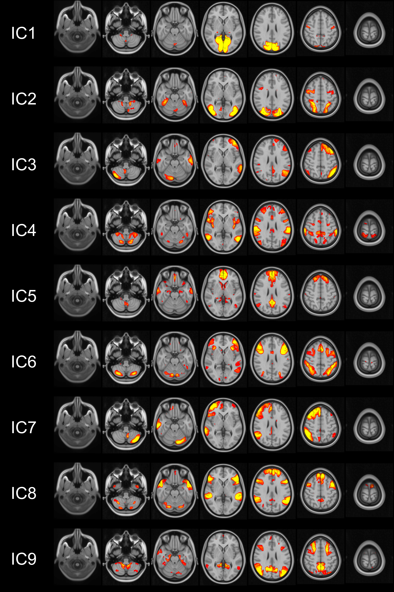

# Functional Connectivity Correlates of SSRI Use in Anxiety Disorders: A Resting-State fMRI Study
Thesis Project Repository – James Schonknecht

  

## Overview
This repository contains the code associated with my Postgraduate Certificate in Pharmacy dissertation project, which investigated correlations between brain functional connectivity, SSRI use, and lifetime history of anxiety disorders in a large cohort from the UK Biobank.
